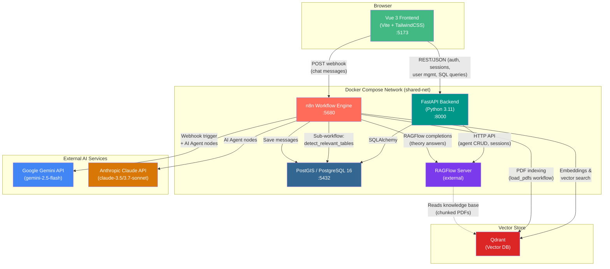
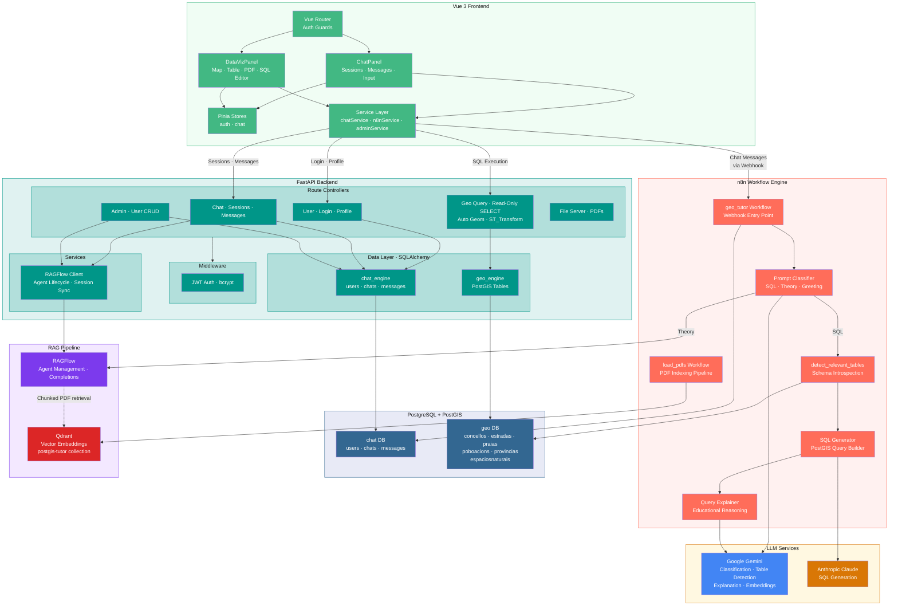
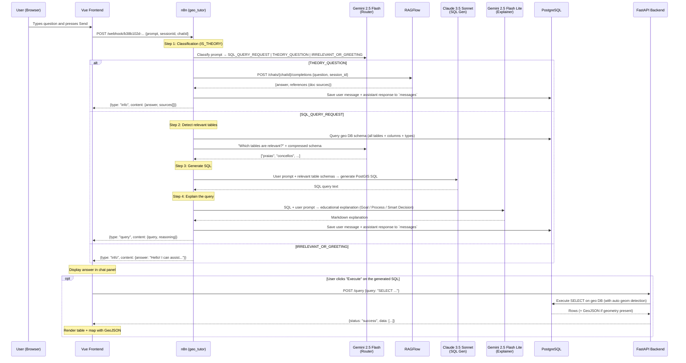
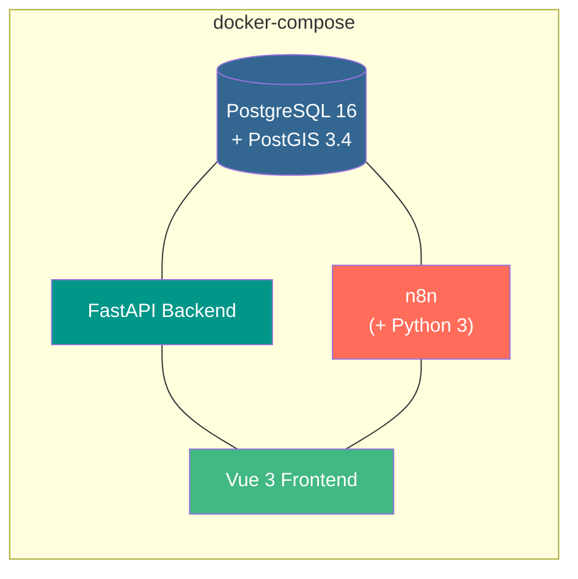

# AI Tutor GIS — Architecture Documentation

## 1. Overview

**Virtual Professor** is an AI-powered educational assistant for a PostGIS / Geospatial SQL course. It combines a conversational chat interface with a data-visualization panel (maps, tables, PDF viewer) and an integrated SQL editor. Under the hood an **n8n** workflow engine orchestrates multiple LLM calls to classify user questions, generate PostGIS SQL, explain queries, and answer theory questions backed by a RAG (Retrieval-Augmented Generation) knowledge base.

---

## 2. High-Level Architecture Diagram



### Detailed Component Breakdown



---

## 3. Component Details

### 3.1 Frontend — `n8n_tutor_client/`

| Aspect | Detail |
|---|---|
| **Framework** | Vue 3 (Composition API) + Vite 6 |
| **Styling** | Tailwind CSS 4 + `@tailwindcss/typography` |
| **State management** | Pinia (`auth` store, `chat` store) |
| **Routing** | Vue Router 4 with auth guards (`requiresAuth`, `requiresAdmin`, `requiresGuest`) |
| **Icons** | Lucide Vue Next |
| **PDF rendering** | `vue-pdf-embed` |
| **Mapping** | Leaflet with `proj4leaflet` (coordinate re-projection EPSG:23029 → 4326) |
| **SQL editor** | CodeMirror 6 with PostgreSQL syntax highlighting |
| **Markdown** | `marked` + `DOMPurify` for safe HTML rendering |
| **Containerisation** | Node 18 Docker image, dev server on `:5173` |

#### Key Pages & Components

| Route / Component | Purpose |
|---|---|
| `/login` → `Login.vue` | JWT-based authentication |
| `/chat` → `ChatView.vue` | Main two-panel layout |
| `/admin/users` → `AdminUserManagement.vue` | Admin-only user CRUD |
| `ChatPanel.vue` | Message list, chat session switcher, text input |
| `DataVizPanel.vue` | Right-side panel with Map / Table / PDF tab switcher + SQL editor |
| `MapView.vue` | Leaflet map for GeoJSON visualisation |
| `TableView.vue` | Tabular display of SQL query results |
| `PdfView.vue` | In-browser PDF viewer for course material |

#### Service Layer

| Service | Responsibilities |
|---|---|
| `chatService.js` | Authenticated calls to the backend (`/api/agent`, `/api/agents/:id/sessions`, etc.) |
| `n8nService.js` | Directly calls the n8n webhook for chat messages; executes SQL via `POST /query`; serves PDFs from `/docs/` |
| `adminService.js` | Admin endpoints: list users, create user, bulk-create, delete user |

#### Important Configuration

```
VITE_BACKEND_BASE_URL  →  http://localhost:8000   (FastAPI)
VITE_N8N_WEBHOOK_URL   →  http://localhost:5680/webhook/b38b102d-...  (n8n geo_tutor webhook)
```

---

### 3.2 Backend — `n8n_tutor_backend/`

| Aspect | Detail |
|---|---|
| **Framework** | FastAPI (Python 3.11) |
| **ORM / DB** | SQLAlchemy (raw SQL via `text()`) + `psycopg2-binary` |
| **Auth** | JWT (`python-jose`), bcrypt password hashing (`passlib`) |
| **Containerisation** | Python 3.11-slim Docker image, Uvicorn on `:8000` |

#### Databases Served

| Engine | Database | Purpose |
|---|---|---|
| `chat_engine` | `chat` | Users, chat sessions, messages |
| `geo_engine` | `geo` | PostGIS geographic data (the course exercise data) |

#### API Endpoints

| Method | Endpoint | Auth | Description |
|---|---|---|---|
| `POST` | `/api/login` | Public | Returns JWT access token |
| `GET` | `/api/agent` | Bearer | Get the RAGFlow agent ID for the current user |
| `GET` | `/api/user/profile` | Bearer | Get user profile (includes `is_admin`) |
| `POST` | `/api/agents/{id}/sessions` | Bearer | Create a new chat session (→ RAGFlow + local DB) |
| `GET` | `/api/agents/{id}/sessions` | Bearer | List all sessions for an agent |
| `GET` | `/api/agents/{id}/sessions/{sid}` | Bearer | Get a single session with all messages |
| `POST` | `/query` | Public | Execute a read-only SELECT against the `geo` database; auto-detects geometry columns and wraps with `ST_AsGeoJSON(ST_Transform(..., 4326))` |
| `GET` | `/files/{name}` | Bearer | Serve a PDF from the file repository |
| `POST` | `/api/admin/create-user` | Admin | Create user + RAGFlow agent |
| `DELETE` | `/api/admin/users/{username}` | Admin | Delete user + RAGFlow agent |
| `GET` | `/api/admin/users` | Admin | List all users |

#### Startup Sequence

1. Wait 15 seconds for dependent services.
2. Create admin user (checks RAGFlow for existing agent, reuses if found).
3. Start Uvicorn with hot-reload.

---

### 3.3 n8n Workflow Engine — `n8n/`

n8n is the **AI orchestration layer**. It receives user prompts from the frontend, classifies them, routes them to the appropriate LLM pipeline, persists messages, and returns structured responses.

| Aspect | Detail |
|---|---|
| **Image** | `n8nio/n8n:latest` (Alpine-based, extended with Python 3 + psycopg2) |
| **Port** | External `:5680` → Internal `:5678` |
| **Init** | `init.sh` waits for PostgreSQL, runs `insert_sql.py`, imports workflows + credentials, then starts n8n |

#### Workflows

| # | Workflow Name | Trigger | Purpose |
|---|---|---|---|
| 1 | **`geo_tutor`** (active) | Webhook `POST /webhook/b38b102d-...` | **Main chat entry point** — classifies, routes, and responds to user messages |
| 2 | **`detect_relevant_tables`** | Sub-workflow (called by `geo_tutor`) | Queries the `geo` DB schema, uses Gemini to pick relevant tables |
| 3 | **`generate_geo_query`** | Sub-workflow (unused/legacy) | Standalone geo-query generation with Claude |
| 4 | **`load_pdfs`** | Manual trigger | Indexes course PDFs into Qdrant vector store (two paths: raw chunking & Gemini-enriched descriptions) |
| 5 | **`insert_documents_ragflow`** | Manual trigger | Creates a RAGFlow dataset, uploads PDFs, and triggers parsing/chunking |

---

### 3.4 PostgreSQL + PostGIS — `postgres`

| Aspect | Detail |
|---|---|
| **Image** | `postgis/postgis:16-3.4` |
| **Port** | Configurable via `POSTGRES_PORT_HOST` → `:5432` |

#### Database: `chat`

```sql
CREATE TABLE users (
    id           SERIAL PRIMARY KEY,
    username     VARCHAR(255) UNIQUE NOT NULL,
    hashed_password TEXT NOT NULL,
    agent_id     VARCHAR(255) UNIQUE NOT NULL,
    created_at   TIMESTAMP WITH TIME ZONE DEFAULT CURRENT_TIMESTAMP,
    is_admin     BOOLEAN DEFAULT FALSE
);

CREATE TABLE chats (
    id         TEXT PRIMARY KEY,       -- RAGFlow session ID
    user_id    INTEGER REFERENCES users(id) ON DELETE CASCADE,
    created_at TIMESTAMP WITH TIME ZONE DEFAULT CURRENT_TIMESTAMP
);

CREATE TABLE messages (
    id        SERIAL PRIMARY KEY,
    chat_id   TEXT REFERENCES chats(id) ON DELETE CASCADE,
    sender    TEXT NOT NULL,           -- 'user' | 'assistant'
    message   TEXT NOT NULL,
    docs      TEXT[],                  -- JSON-encoded source references
    timestamp TIMESTAMP DEFAULT CURRENT_TIMESTAMP,
    is_theory BOOLEAN DEFAULT FALSE    -- true = theory answer, false = SQL answer
);
```

#### Database: `geo`

Geographic / exercise data for the PostGIS course. Tables are populated during initialization via SQL scripts:

| Table | Description | Geometry |
|---|---|---|
| `concellos` | Municipalities | Polygon (EPSG:23029) |
| `espaciosnaturais` | Natural parks / protected areas | Polygon / MultiPolygon |
| `estradas` | Roads | LineString |
| `poboacions` | Population centres | Point |
| `praias` | Beaches | Point (EPSG:23029) |
| `provincias` | Provinces | Polygon |

All geometry columns use **EPSG:23029** (ED50 / UTM Zone 29N — Galicia, Spain). The backend converts to **EPSG:4326** (WGS 84) via `ST_Transform` before returning GeoJSON to the frontend.

---

### 3.5 RAGFlow (External Service)

RAGFlow provides a managed RAG (Retrieval-Augmented Generation) pipeline:

- **Agents**: Each user gets a dedicated RAGFlow "chat agent" linked to a shared knowledge-base dataset.
- **Sessions**: Chat sessions are created per-agent in RAGFlow and mirrored in the local `chat` database.
- **Completions**: Theory questions are forwarded to `POST /api/v1/chats/{agent_id}/completions` for RAG-augmented answers.
- **Documents**: Course PDFs are uploaded, parsed (using Gemini for layout recognition), and chunked by RAGFlow.

---

### 3.6 Qdrant (Vector Database)

Used by the `load_pdfs` n8n workflow to store vector embeddings of course material. Embeddings are generated with **Google Gemini `text-embedding-004`** and stored in a collection named `postgis-tutor`.

---

## 4. Main Chat Flow (geo_tutor Workflow)



---

## 5. LLM Prompts / System Messages

This section documents the exact system prompts passed to each LLM at every stage of the pipeline.

### 5.1 Router / Classifier — `IS_THEORY` (Gemini 2.5 Flash)

**Purpose**: Classify the user's message into one of three categories to determine routing.

```
You are an expert AI router and initial contact point for a PostGIS and database course
assistant. Your task is to analyze the user's prompt and respond according to one of three
categories. Your response will either be a classification label for downstream tasks or a
direct, predefined answer.

### Categories

1.  **`SQL_QUERY_REQUEST`**: The user is asking for a practical query, wants to retrieve data,
    or is trying to solve a hands-on exercise.
    *   *Examples*: "Find all parks within 5km of a hospital", "Show me the names of all
        schools in the 'downtown' district", "count the number of cities per country".

2.  **`THEORY_QUESTION`**: The user is asking a general knowledge question about the course
    subject (PostGIS, SQL, databases), the course logistics (syllabus, evaluation, teachers),
    or wants a conceptual explanation.
    *   *Examples*: "What is a spatial index?", "Explain the difference between ST_Intersects
        and ST_Contains", "What topics are on the final exam?".

3.  **`IRRELEVANT_OR_GREETING`**: The user's prompt is a simple greeting, a sign-off, or is
    completely unrelated to the course material.
    *   *Examples*: "hello", "how are you?", "thank you", "what is your name?",
        "what is the weather like?".

### Response Rules (CRITICAL)

*   IF the prompt is a `SQL_QUERY_REQUEST` or `THEORY_QUESTION`, respond with ONLY the
    category name.
*   IF the prompt is `IRRELEVANT_OR_GREETING`, respond with the exact, predefined text:
    `Hello! I can assist with questions about your PostGIS course or help generate SQL
    queries. What can I help you with today?`
*   Do not add any other text, explanations, or comments to your output.
```

---

### 5.2 Table Detector — `detect_relevant_tables` sub-workflow (Gemini 2.5 Flash)

**Purpose**: Given the user prompt and a compressed database schema, identify which tables are relevant.

```
You are a database schema analyst. Your only task is to identify which tables from the
database schema are relevant to answering a user's query.

You have access to a list of tables and their columns. Use that information to reason about
which tables are involved in fulfilling the user's request.

Instructions:
- Use only the schema information — do not guess table names.
- If you are unsure about column meanings, prefer including potentially relevant tables
  rather than excluding them.
- Return a JSON array of relevant table names, and nothing else.
- Do not explain your reasoning.

Example output:
["comarcas", "concellos"]

**DATABASE SCHEMA**:
{{ compressed schema as JSON }}

**COLUMN TYPES**:
{{ type abbreviation map }}
```

The schema is dynamically fetched from the `geo` database by querying `pg_class`, `pg_namespace`, `pg_attribute`, and `pg_type` system catalogs, then compressed into an abbreviated format to save tokens.

---

### 5.3 SQL Generator — `SQL QUESTION` (Claude 3.5 Sonnet)

**Purpose**: Convert the user's natural language question into a valid PostGIS SQL query.

```
You are an expert Geospatial SQL Assistant. Your purpose is to convert a user's natural
language question into a single, valid PostGIS SQL query. Your output must always be only
the SQL query.

### Core Task
Analyze the user's prompt and the provided table schemas to generate a precise SQL query.

### Geospatial Rule
A critical part of your task is to determine if the user's query requires a geometry column
for map visualization.

1.  **Analyze User Intent:** Look for spatial keywords (e.g., "map", "where", "location",
    "area", "plot", "show me on a map").
2.  **Generate Query with Geometry:** If the intent is spatial and a geometry column exists:
    *   The geometry column must be aliased as `geom`.
    *   If the query uses GROUP BY, aggregate geometry with `ST_Union()`.
3.  **Generate Query without Geometry:** If not spatial or no geometry column available.

### Output Rules
1. Your output must be a single, valid SQL query.
2. DO NOT output thoughts, explanations, comments, or function calls.
3. DO NOT wrap the query in markdown (no ```sql).
4. Only output one valid SQL query as plain text.

**RELEVANT TABLES:**
{{ filtered table schemas as JSON }}
```

---

### 5.4 Query Explainer — `EXPLAIN QUERY` (Gemini 2.5 Flash Lite)

**Purpose**: Provide an educational, three-part explanation of the generated SQL query.

```
You are an expert PostGIS and SQL educator. You must detect the language of the user's
question and provide your entire explanation in that same language.

Your goal is to explain a given query in a way that is both concise and insightful, like a
great teacher explaining a concept on a whiteboard.

Your explanation must be structured into three short, focused sections:

### 1. The Goal (What are we doing?)
Start with a simple, high-level summary. In one or two sentences, what real-world question
is this query answering?

### 2. The Process (How are we doing it?)
Briefly describe the query's main steps. Explain the core spatial function in simple terms.
Don't explain every line of code, just the essential logic.

### 3. The Smart Decision (Why was it done this way?)
Isolate the single most clever or important decision in the query and explain the reasoning
behind it. Focus on performance, readability, or analytical need.

Your tone must be clear and educational. Use Markdown to highlight key terms.
```

---

### 5.5 RAGFlow Agent Prompt (for Theory Questions)

When a user is created, a RAGFlow agent is configured with this prompt template:

```
Eres un asistente inteligente. Por favor, resume el contenido de la base de conocimientos
para responder a la pregunta. Enumera los datos de la base de conocimientos y responde en
detalle. Cuando todo el contenido de la base de conocimientos sea irrelevante para la
pregunta, tu respuesta debe incluir la frase "¡La respuesta que buscas no se encuentra en
la base de conocimientos!". Las respuestas deben tener en cuenta el historial del chat.
Aquí está la base de conocimientos:
{knowledge}
Lo anterior es la base de conocimientos.
```

**Translation**: *"You are an intelligent assistant. Please summarize the knowledge base content to answer the question. List the knowledge base data and respond in detail. When all knowledge base content is irrelevant to the question, your response must include the phrase 'The answer you're looking for is not in the knowledge base!'. Responses should take into account the chat history. Here is the knowledge base: {knowledge} The above is the knowledge base."*

RAGFlow agent configuration:

- `similarity_threshold`: 0.2
- `keywords_similarity_weight`: 0.7
- `top_n`: 6 (documents retrieved)
- `top_k`: 1024
- `cross_languages`: Spanish
- `reasoning`: enabled
- `refine_multiturn`: enabled

---

### 5.6 PDF Indexing Prompt — `load_pdfs` workflow (Gemini 2.5 Flash Lite)

Used for enriching PDF content before inserting into the vector store:

```
Eres un motor especializado en análisis e indexación de documentos. Tu único propósito es
procesar un documento PDF proporcionado y generar una única descripción altamente detallada,
completa y optimizada para la búsqueda. Este resultado será ingerido directamente en un
sistema de Generación Aumentada por Recuperación (RAG) para maximizar la capacidad de
búsqueda y la precisión en la recuperación de contenido.

Instrucciones Fundamentales:

1. Análisis Comprensivo del Contenido:
   - Resumen Integral del tema, propósito, audiencia y narrativa general.
   - Extracción Detallada de todos los temas, subtemas, argumentos, estadísticas y
     conclusiones.
   - Reconocimiento de Entidades: personas, organizaciones, ubicaciones, fechas, productos,
     estándares y terminología técnica.

2. Enriquecimiento Semántico y Contextual para RAG:
   - Expansión de Palabras Clave y Sinónimos para anticipar todas las posibles consultas.
   - Aclaración Contextual e Información Implícita — ir más allá del texto literal.

3. Descripción Detallada de Elementos Visuales:
   - Describir exhaustivamente cada fotografía, gráfico, diagrama, tabla y diagrama de flujo.

4. Mandatos Estilísticos:
   - Tono Directo y Autoritativo (no usar lenguaje especulativo).
   - Maximizar Detalle y Verbosidad — la máxima densidad de información es el objetivo.
```

**Translation**: *"You are a specialized engine for document analysis and indexing. Your sole purpose is to process a provided PDF document and generate a single, highly detailed, complete, and search-optimized description. This output will be ingested directly into a RAG system to maximize search capability and retrieval accuracy…"*

---

## 6. Deployment & Infrastructure

### Docker Compose Services



| Service | Image / Build | Ports | Depends On |
|---|---|---|---|
| `postgres` | `postgis/postgis:16-3.4` | `${POSTGRES_PORT_HOST}:5432` | — |
| `n8n` | `n8nio/n8n:latest` (custom Dockerfile adds Python) | `5680:5678` | postgres |
| `backend` | Python 3.11-slim (from `n8n_tutor_backend/Dockerfile`) | `8000:8000` | postgres |
| `frontend` | Node 18 (from `n8n_tutor_client/Dockerfile`) | `5173:5173` | backend |

All services share the `shared-net` Docker network.

### Init Sequence (`init.sh`)

1. Wait for PostgreSQL readiness (`pg_isready`).
2. Run `insert_sql.py` — creates `geo` and `chat` databases, enables PostGIS, creates tables (`users`, `chats`, `messages`), executes all `.sql` files to populate geographic data.
3. Import n8n workflows from `workflows.json`.
4. Activate the `geo_tutor` workflow.
5. Import n8n credentials from `credentials.json`.
6. Start n8n.

### Environment Variables

| Variable | Service | Purpose |
|---|---|---|
| `POSTGRES_USER` / `POSTGRES_PASSWORD` | All | Shared DB credentials |
| `POSTGRES_DB_CHAT` / `POSTGRES_DB_GEO` | Backend, n8n | Database names |
| `GEMINI_API_KEY` | n8n | Google Gemini API access |
| `ANTHROPIC_API_KEY` | n8n | Anthropic Claude API access |
| `RAGFLOW_API_URL` / `RAGFLOW_API_KEY` | Backend | RAGFlow API access |
| `SECRET_KEY` / `ALGORITHM` | Backend | JWT signing |
| `ADMIN_USER` / `ADMIN_PASSWORD` | Backend | Auto-created admin account |
| `DATASET_ID` | Backend | RAGFlow knowledge-base dataset |
| `N8N_ENCRYPTION_KEY` | n8n | Credential encryption |
| `VITE_BACKEND_BASE_URL` | Frontend | Backend URL at build time |
| `VITE_N8N_WEBHOOK_URL` | Frontend | n8n webhook URL at build time |

---

## 7. Data Flow Summary

| Flow | Path |
|---|---|
| **Login** | Frontend → `POST /api/login` → Backend (JWT via `python-jose`) → PostgreSQL (`users` table) |
| **Chat message** | Frontend → `POST /webhook/...` → n8n `geo_tutor` → LLMs → save to PostgreSQL → return to Frontend |
| **Theory question** | n8n → RAGFlow (RAG over course PDFs) → answer + document references |
| **SQL generation** | n8n → `detect_relevant_tables` (schema + Gemini) → `SQL QUESTION` (Claude) → `EXPLAIN QUERY` (Gemini) |
| **Query execution** | Frontend → `POST /query` → Backend → PostGIS `geo` DB → GeoJSON response → Leaflet map + table |
| **PDF viewing** | Frontend fetches from `/files/{filename}.pdf` via backend (served from `n8n_tutor_backend/pdf_repo`) |
| **User management** | Admin Frontend → Backend → RAGFlow (create/delete agent) + PostgreSQL |
| **PDF ingestion** | n8n `load_pdfs` → Gemini (PDF analysis) → embeddings (Gemini `text-embedding-004`) → Qdrant |
| **RAGFlow ingestion** | n8n `insert_documents_ragflow` → RAGFlow API (create dataset, upload PDFs, parse/chunk) |
